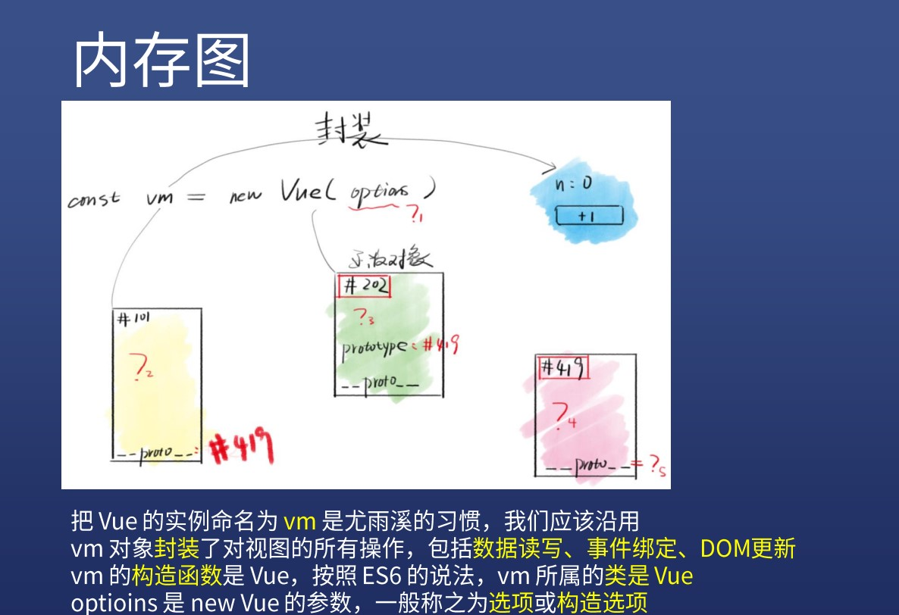

# 创建vue实例
### 
### options有什
*  options的五类属性
1. 数据: data(数据),props(属性),propsData,computed(计算的),methods(方法),watch(观察)
2. DOM:el(容器,挂载点),template(html内容),render(渲染),renderError 
3. 生命周期钩子:beforeCreate(生之前),created(生之后),beforeMount,mounted(挂载),beforeUpdate,updated(更新之后),activated,deactivated,beforeDestory,destroyed(消亡),errorCaptured
4. 资源:directives,filters,components
5. 组合:parent(父母),minins(混入),extends(扩展),provide(提供),inject(注入 )

### 入门属性
1. el-挂载点----可以用$mount代替
2. data-内部数据----支持对象和函数,优先用函数
3. methods-方法----事件处理函数或者普通函数
4. components----Vue组件,注意大小写,三种引用方式,推荐最后一种
5. 四个钩子
* created-实例出现在内存中
* mounted-实例出现在页面中
* updated-实例更新了
* destroyed-实例从页面和内存中消亡

6. props-外部数据
* 也叫属性
* message="n"传入字符串
* :message="n"传入this.n数据
* :fn="add"传入this.add函数