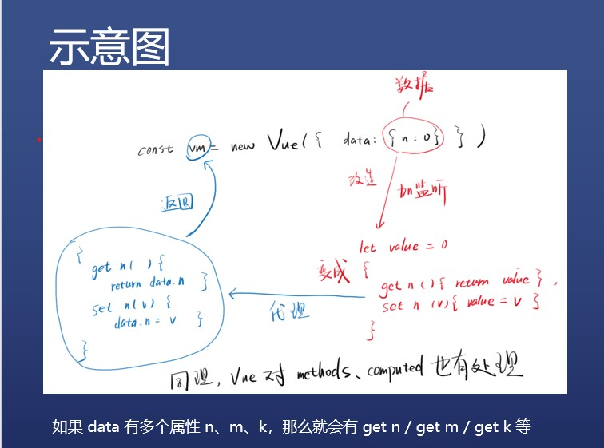

# vue数据响应式

### vue对data做了什么
### 小实验
* data 变了
[示例代码](https://codesandbox.io/s/competent-forest-embgj)：myData 居然变了
一开始是 {n:0}，传给 new Vue 之后立马变成 {n: (...)}
{n: (...)} 是个什么玩意，为什么表现和 {n:0} 一致？
我们需要先学习一下 [ES 6](https://developer.mozilla.org/zh-CN/docs/Web/JavaScript/Reference/Statements/block) 的 [getter和setter](https://developer.mozilla.org/zh-CN/docs/Web/JavaScript/Reference/Operators/Object_initializer#ECMAScript_6%E6%96%B0%E6%A0%87%E8%AE%B0)
[示例代码](https://codesandbox.io/s/vigorous-franklin-p6l8m)
学完之后呢？还是不理解 {n: (...)} 呀
我们需要再学习一下 [Object.defineProperty](https://developer.mozilla.org/zh-CN/docs/Web/JavaScript/Reference/Global_Objects/Object/defineProperty)
学完之后呢？依然不理解
[继续实验](https://codesandbox.io/s/bold-heyrovsky-8jcm2)

### 小结
1. Object.defineProperty
* 可以给对象添加属性 value
* 可以给对象添加 getter / setter
* getter / setter 用于对属性的读写进行监控
2. 啥是代理（设计模式）
* 对 myData 对象的属性读写，全权由另一个对象 vm 负责
* 那么 vm 就是 myData 的代理（类比房东租房）
* 比如 myData.n 不用，偏要用 vm.n 来操作 myData.n
3. vm = new Vue({data: myData})
* 一、会让 vm 成为 myData 的代理（proxy）
* 二、会对 myData 的所有属性进行监控
* 为什么要监控，为了防止 myData 的属性变了， vm 不知道
* vm 知道了又如何？知道属性变了就可以调用 render(data) 呀！
* UI = render(data)
* 

### 数据响应式
1. 什么是响应式
* 我打你一拳，你会喊疼，那你就是响应式的
* 若一个物体能对外界的刺激做出反应，它就是响应式的
2. Vue 的 data 是响应式
* const vm = new Vue({data: {n: 0}})
* 我如果修改 vm.n，那么 UI 中的 n 就会响应我
* Vue 2 通过 Object.defineProperty 来实现数据响应式
3. 响应式网页是啥？
* 如果我改变窗口大小，网页内容会做出响应，那就是响应式网页
* 比如[网址](https://www.smashingmagazine.com/)
* 但是你要注意，用户没事不会拖动网页大小的

### vue好像有bug
1. Object.defineProperty 的问题
* Object.defineProperty(obj, 'n' , {...})
* 必须要有一个 'n'，才能监听 & 代理 obj.n 对吧
* 如果前端开发者比较水，没有给 n 怎么办
* [示例一](https://codesandbox.io/s/empty-field-ofmwn)：Vue 会给出一个警告
* [示例二](https://codesandbox.io/s/youthful-mendel-kc262)：Vue 只会检查第一层属性
* 此时如果我点击 set b，请问视图中会显示 1 吗？
* 答案是：不会
* 为什么：因为 Vue 没法监听一开始不存在的 obj.b
2. 解决办法
* 一、那我把 key 都声明好，后面不再加属性不就行了
* 二、使用 Vue.set 或者 this.$set

### Vue.set 或者 this.$set
1. 作用
* 新增 key
* 自动创建代理和监听（如果没有创建过）
* 触发 UI 更新（但并不会立刻更新）
2. 举例
* this.$set(this.object, 'm', 100)

### data中有数组怎么办?
1. 你没法提前声明所有 key
* [示例1](https://codesandbox.io/s/proud-worker-xwyoo)：数组的长度可以一直增加，下标就是 key
* 你看，你没有办法提前把数组的 key 都声明出来
* Vue 也不能检测对你新增了下标
* 难道每次改数组都要用 Vue.set 或者 this.$set
2. 尤雨溪的做法
* 篡改数组的 API，见文档中「变异方法」章节
* 这 7 个 API 都会被 Vue 篡改，调用后会更新 UI

```
es6写法
class VueArray extends Array{
  push(...args){
    const oldLength = this.length // this 就是当前数组
    super.push(...args)
    console.log('你 push 了')
    for(let i = oldLength; i<this.length; i++){
      Vue.set(this, i, this[i])
      // 将每个新增的 key 都告诉 Vue
    }
  }
}
不代表vue的真实实现
```
### 总结
1. 对象中新增的 key
* Vue 没有办法事先监听和代理
* 要使用 set 来新增 key，创建监听和代理，更新 UI
* 最好提前把属性都写出来，不要新增 key
* 但数组做不到「不新增 key」
2. 数组中新增的 key
* 用 set 新增 key，会更新 UI，但不会创建监听和代理
* 不过尤玉溪篡改了 7 个 API 方便你对数组进行增删
* 这 7 个 API 会更新 UI，但不会自动处理监听和代理
* this.array[n] = xxx，即不会更新 UI，也不会自动处理监听和代理
* 结论：数组新增 key 最好通过 7 个 API
